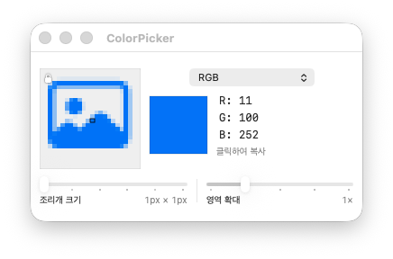

# ColorPicker

ColorPicker is a small, native macOS app for reading the color under the current mouse position. Its layout takes the compact Digital Color Meter-style workflow as a starting point, without showing a monitor name.


한국어 문서: [README.ko.md](README.ko.md)



## What it does

- Captures the current cursor region with Apple's ScreenCaptureKit.
- Shows a pixelated magnifier on the left and an aperture outline over the sampled square.
- Samples a square aperture of `1 × 1`, `2 × 2`, `4 × 4`, `8 × 8`, `16 × 16`, or `32 × 32` physical screen pixels.
- Lets you zoom the displayed region to `0.5×`, `1×`, `2×`, `4×`, or `8×`; it affects only the magnifier preview, not the aperture measurement.
- Displays `RGB`, `RGB (normalized)`, `sRGB`, `sRGB (normalized)`, `P3`, or `Hex`.
- Copies a displayed value when its value area is clicked.
- Provides global shortcuts to lock the coordinate and copy a fresh sample.
- Quits the application process when its last window is closed.

## Sampling behavior

For an aperture larger than one pixel, ColorPicker converts every captured pixel to linear-light sRGB and takes the arithmetic mean of its red, green, and blue components. It then converts that representative color to the selected output space. This produces a physically meaningful average and follows the practical convention in macOS Digital Color Meter: when more than one pixel is inside an aperture, pixel color values are averaged.

The magnifier has an independent **Area Zoom** control:

| Value | Preview behavior |
| --- | --- |
| 0.5× | Shows a wider source region (less magnification). |
| 1× | Default source region. |
| 2× / 4× / 8× | Shows an increasingly smaller source region (more magnification). |

At the edge of a display, the aperture is shifted inward so it keeps its requested square size whenever the display has enough pixels.

On Retina displays, ColorPicker derives the backing scale from the display mode's physical pixel dimensions and aligns every capture rectangle to that backing-pixel grid. The magnifier therefore enlarges native screen pixels without first downsampling them.

## Color formats and clipboard output

| Format | Display range | Clipboard example |
| --- | --- | --- |
| RGB | Generic calibrated RGB, 0–255 | `210, 210, 210` |
| RGB (normalized) | Generic calibrated RGB, 0.000–1.000 | `0.823, 0.823, 0.823` |
| sRGB | IEC sRGB, 0–255 | `210, 210, 210` |
| sRGB (normalized) | IEC sRGB, 0.000–1.000 | `0.823, 0.823, 0.823` |
| P3 | Display P3, 0–255 | `210, 210, 210` |
| Hex | Uppercase six-digit sRGB | `#D2D2D2` |

Component values are copied with `, ` as the separator. Hex is copied as its single value.

## Shortcuts

| Shortcut | Action |
| --- | --- |
| Command-Shift-F | Toggle coordinate lock. When locked, the aperture stays at the cursor position where it was locked. |
| Command-Shift-S | Capture the current (or locked) coordinate and copy it in the selected format. |

The shortcuts are registered globally and work while another app is active. The ColorPicker menu also exposes the same actions.

## Install

Download the latest `ColorPicker-*-macOS-arm64.zip` and its `.sha256` file from [Releases](https://github.com/jaewonE/ColorPicker/releases), then:

```zsh
cd ~/Downloads
shasum -a 256 -c ColorPicker-*-macOS-arm64.zip.sha256
unzip ColorPicker-*-macOS-arm64.zip
mv ColorPicker.app /Applications/
open /Applications/ColorPicker.app
```

The first launch needs **Screen Recording** permission because macOS protects screen pixels. ColorPicker verifies access by trying a real ScreenCaptureKit frame. If capture is unavailable, use **Check Permission Again**, grant access, and relaunch ColorPicker so the running process receives the updated permission.

Release archives are ad-hoc signed rather than signed with an Apple Developer certificate. A rebuilt or updated binary can therefore have a different code hash even though its bundle identifier is unchanged. If System Settings shows ColorPicker as enabled but the app is still denied, quit ColorPicker and reset only its stale Screen Recording record:

```zsh
tccutil reset ScreenCapture com.jaewone.colorpicker
open /Applications/ColorPicker.app
```

Approve the new request, then quit and open ColorPicker once more. This reset does not change another app's Screen Recording permission. If Gatekeeper blocks a downloaded archive, Control-click `ColorPicker.app` and choose **Open** once.

## Build from source

Requirements: macOS 14 or later, Xcode 16 or later, and Apple Silicon.

```zsh
swift test
./Scripts/build_app.sh
./Scripts/package_release.sh
./Scripts/install_app.sh
```

`build_app.sh` creates `dist/ColorPicker.app`, `package_release.sh` creates a ZIP plus SHA-256 checksum, and `install_app.sh` places the app at `/Applications/ColorPicker.app`.

## Privacy and limits

ColorPicker has no settings screen, no network activity, no analytics, and no persistent color history. It only captures the small on-screen region required to display the live magnifier and color value. It samples SDR screen output; extended dynamic range content is converted to the app's SDR sampling path and may not preserve an original HDR scene value.

## License

[GNU GPL v3.0](LICENSE)
